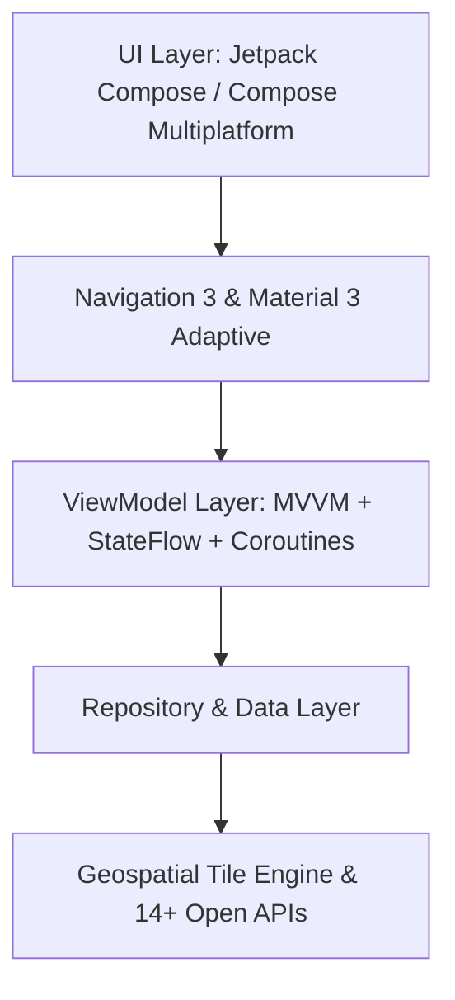

# Don't Cross the Streams 🐾🌊

[](https://github.com/masterpigg/dont-cross-the-streams/actions/workflows/deploy-and-build.yml)
[](https://kotlinlang.org)
[](https://github.com/JetBrains/compose-multiplatform)
[](https://masterpigg.github.io/dont-cross-the-streams/)

> **An interactive ecological decision-support system and multiplatform visualization platform mapping wildlife migration corridors against human linear infrastructure barriers.**

---

## 🌍 Overview & Project Purpose

Human civilization relies heavily on closed-loop infrastructure networks—highways, railways, hydroelectric dams, canal systems, and expanding urban sprawl. While critical for human mobility and commerce, these physical barriers fragment ecosystems, sever ancient animal migration corridors, isolate species populations, and drastically elevate roadkill/collision mortality rates.

**Don't Cross the Streams** bridges the gap between complex geospatial ecological data and accessible, actionable environmental decision-making. Built as an educational research tool for students, ecologists, urban planners, and wildlife conservationists, the application visualizes human-wildlife conflict zones in real time and evaluates targeted engineering interventions to restore natural connectivity.

---

## ✨ Key Features

### 🗺️ Multi-Layer Conflict Map Engine
An interactive, high-performance geospatial viewer powered by Esri / OpenStreetMap raster tile engines:
- **Wildlife Occurrences Layer**: Real-time species sightings categorized by ecological sensitivity and conservation status.
- **Collision & Roadkill Hotspots**: Pulsing halo overlays highlighting high-frequency incident corridors.
- **Linear Infrastructure Barriers**: Color-coded networks of interstates, passenger/freight railways, dams, and urban boundaries.
- **Population Density Heatmaps**: Human development footprint indices integrated directly into ecological overlays.

### 📍 Regional Quick Presets
One-tap instant camera jump presets configured for famous national and regional ecological bottleneck zones:
1. **Missouri I-70**: Whitetail deer & turtle corridor crossings across central Missouri.
2. **Ozarks & Bagnell Dam**: Lake of the Ozarks aquatic, reptile, and dam spillway barriers.
3. **St. Louis Metro Area**: Urban sprawl fragmentation and amphibian wetland migrations.
4. **Shawnee National Forest (Snake Road)**: Bi-annual seasonal road closures for snake and amphibian migration.
5. **Seattle Ballard Locks**: Salmon passage and marine mammal lock navigation conflicts.
6. **Columbia River Hydroelectric Dams**: Critical Pacific salmon migratory fish ladder corridors.
7. **Yellowstone Migration Corridor**: Elk, pronghorn, and grizzly bear highway crossing hotspots.
8. **CA-17 Santa Cruz Mountains**: Highway 17 mountain lion habitat connectivity barriers.
9. **Florida Panther Corridor**: US-41 (Alligator Alley) vehicle collision hotspots and underpass networks.

### 📊 Conflict Risk Scorecard & Matrix
A dynamic composite risk algorithm evaluating site-specific ecological threat levels:
- **Composite Risk Score (0–100)**: Instant numerical evaluation based on traffic volume, species vulnerability, barrier density, and historical incident records.
- **Sub-Factor Breakdown Bars**: Visual rating indicators for individual risk vectors.
- **Closed-Loop Mitigation Matrix**: Actionable engineering recommendations including:
  - 🌉 **Wildlife Overpasses & Eco-Bridges**: Vegetated green bridges for large mammals.
  - 🦔 **Eco-Culverts & Amphibian Tunnels**: Directional fencing and low-light underpasses.
  - 🐟 **Fish Ladders & Salmon Cannons**: Hydrodynamic fishways for dam bypass.
  - 🚗 **Dynamic Speed Corridors**: Seasonal variable speed limit signs and thermal detection warnings.

### 🌐 Open Data Transparency Hub
A searchable, fully attributed directory of **14+ open geospatial and ecological APIs**:
- **GBIF** (Global Biodiversity Information Facility)
- **Movebank** (Animal Tracking Data)
- **eBird** (Cornell Lab of Ornithology)
- **iNaturalist** (Community Wildlife Observations)
- **USFWS IPaC** (Information for Planning and Consultation)
- **USGS GAP** (Gap Analysis Project)
- **NatureServe Explorer** (Species Conservation Status)
- **FAA NWSD** (National Wildlife Strike Database)
- **State DOTs** (MoDOT, IDNR, WDFW Roadkill Databases)
- **NHTSA FARS** (Fatality Analysis Reporting System)
- **US Census Bureau** (TIGER/Line & Demographic Footprints)
- **NASA Human Footprint** (Global Human Footprint Index)
- **USACE NID** (National Inventory of Dams)
- **OpenStreetMap Overpass API** (Infrastructure Highway & Rail Networks)

*Every map marker and data card contains clickable web links directly to the underlying raw source records.*

---

## 📱 Supported Platforms

| Platform | Status | Engine / Distribution |
| :--- | :--- | :--- |
| 🤖 **Android** | Production | Native APK (`:app:assembleDebug`) with Esri / OSM tile map integration |
| 🌐 **Web App (WasmJS)** | Live | Kotlin/WasmJS distribution deployed via [GitHub Pages](https://masterpigg.github.io/dont-cross-the-streams/) |
| 🍎 **iOS Target** | Experimental | Compose Multiplatform iOS target (`iosX64`, `iosArm64`, `iosSimulatorArm64`) |

---

## 🏗️ Architecture & Tech Stack

The codebase follows modern Android and Kotlin Multiplatform architecture standards:



- **Language**: Kotlin 2.1.0
- **UI Framework**: Jetpack Compose / Compose Multiplatform 1.7.1
- **Design System**: Material Design 3 (M3 Expressive) with Full Edge-to-Edge display support
- **Adaptive Layouts**: `ListDetailPaneScaffold` from Compose Material 3 Adaptive
- **Navigation**: Jetpack Navigation 3 (`NavDisplay`, `NavBackStack`)
- **State Management**: Reactive MVVM architecture with `StateFlow`, `SharedFlow`, and Kotlin Coroutines

---

## 🚀 Build & Execution Instructions

### Prerequisites
- **JDK 17** or higher configured in your environment (`JAVA_HOME`).
- **Android SDK** (API Level 35 target, API Level 24 minimum).

### 1. Clone the Repository
```bash
git clone https://github.com/masterpigg/dont-cross-the-streams.git
cd dont-cross-the-streams
```

### 2. Build Android APK
```bash
./gradlew :app:assembleDebug
```
The compiled APK will be located at:
`app/build/outputs/apk/debug/app-debug.apk`

### 3. Build Web WasmJS Distribution
```bash
./gradlew :app:wasmJsBrowserDistribution
```
The compiled Web Wasm assets will be generated at:
`app/build/dist/wasmJs/productionExecutable/`

### 4. Run Unit Tests
```bash
./gradlew :app:testDebugUnitTest
```

---

## 🔄 CI/CD Pipeline

The project includes an automated GitHub Actions pipeline configured in `.github/workflows/deploy-and-build.yml`:

- 🤖 **Android Build**: Compiles and verifies the debug APK artifact on every push and pull request.
- 🌐 **GitHub Pages Deployment**: Automatically builds the Kotlin/WasmJS web distribution and publishes it live to [GitHub Pages](https://masterpigg.github.io/dont-cross-the-streams/).
- 🍎 **iOS Verification**: Compiles the experimental Compose Multiplatform iOS framework targets (`iosArm64`, `iosSimulatorArm64`).

---

## 📄 License & Attribution

This project is open-source and intended for educational, research, and non-commercial ecological conservation purposes. Data displayed in the application is sourced from public open APIs under their respective open data licenses (CC-BY, Public Domain, ODbL).
