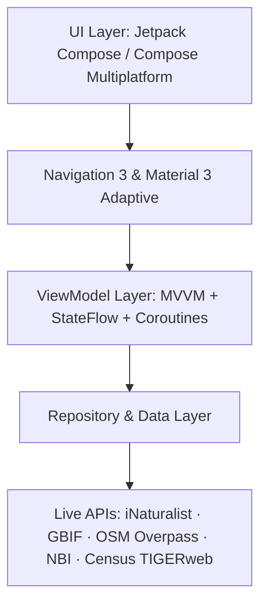

# Don't Cross the Streams 🐾🌊

[](https://github.com/masterpigg/dont-cross-the-streams/actions/workflows/deploy-and-build.yml)
[](https://kotlinlang.org)
[](https://github.com/JetBrains/compose-multiplatform)
[](https://masterpigg.github.io/dont-cross-the-streams/)

> **An interactive ecological decision-support system and multiplatform visualization platform mapping wildlife migration corridors against human linear infrastructure barriers.**

---

## 🌍 Overview & Project Purpose

Human civilization relies heavily on closed-loop infrastructure networks—highways, railways, hydroelectric dams, canal systems, and expanding urban sprawl. While critical for human mobility and commerce, these physical barriers fragment ecosystems, sever ancient animal migration corridors, isolate species populations, and drastically elevate roadkill/collision mortality rates.

**Don't Cross the Streams** bridges the gap between complex geospatial ecological data and accessible, actionable environmental decision-making. Built as an educational research tool for students, ecologists, urban planners, and wildlife conservationists, the application visualizes human-wildlife conflict zones in real time and evaluates targeted engineering interventions to restore natural connectivity.

---

## ✨ Key Features

The app is focused on the **St. Louis region: St. Louis City, St. Louis County and St. Charles County**. Every data point comes live from a public API for the area on screen; there is no hand-entered or sample data. When a source can't be reached, its layer says "unavailable" rather than showing stand-ins.

### 🗺️ Live Conflict Map
- **Wildlife**: research-grade vertebrate sightings from **iNaturalist** plus occurrence records from **GBIF**.
- **Collision Reports**: individual dead-animal reports at their exact location (iNaturalist "Alive or Dead: Dead" annotation), shown as small red dots.
- **Hotspots**: computed in the app by clustering those reports (3+ reports, each within 750 m of another) and labelled with the nearest major road. They are recomputed when you move the map or change the month filter.
- **Crossings & Culverts**: dedicated wildlife crossings mapped in **OpenStreetMap**, plus existing bridges and large culverts over waterways from the **FHWA National Bridge Inventory** (with daily traffic counts) and stream culverts under major roads from OpenStreetMap. These are the routes animals can already use to get under roads.
- **Barriers**: motorways, trunk and primary roads, mainline railways, dams/weirs and canals from **OpenStreetMap**.
- **Population**: 2020 Census tracts from the **Census Bureau's TIGERweb**, shaded by people per km² of land.
- **Month filter**: limit sightings, reports and hotspots to particular months (e.g. the October–November deer rut).
- Each layer loads once you're zoomed in far enough for the APIs to answer quickly; the layer chips show counts or "zoom in".

### 📍 Region Presets
St. Louis Region · St. Louis City · West St. Louis County · Meramec River & I-44 · St. Charles · Busch & Weldon Spring Conservation Areas · Missouri–Mississippi Confluence. Presets only move the map.

### 📊 Study Areas
Side-by-side, live counts for St. Louis City, St. Louis County and St. Charles County: dead-animal reports, sightings, GBIF records, bridges/culverts over water, mapped wildlife crossings, major-road length, 2020 population, land area and density, plus reports and waterway structures per 100 km of major road. Every number names its source.

### 🌐 Data Sources
The five APIs the app queries, with the exact request shapes it sends:
- **iNaturalist API**: sightings and dead-animal reports
- **GBIF Occurrence API**: additional occurrence records
- **OpenStreetMap Overpass API**: barriers, wildlife crossings, culverts, road length
- **FHWA National Bridge Inventory** (BTS NTAD ArcGIS service): bridges and culverts over waterways
- **US Census Bureau TIGERweb**: 2020 tract boundaries, population and land area

*Selecting a sighting, report, crossing or barrier links straight to the original record (iNaturalist observation, GBIF occurrence or OpenStreetMap feature).*

---

## 📱 Supported Platforms

| Platform | Status | Engine / Distribution |
| :--- | :--- | :--- |
| 🤖 **Android** | Production | Native APK (`:app:assembleDebug`) with Esri / OSM tile map integration |
| 🌐 **Web App (WasmJS)** | Live | Kotlin/WasmJS distribution deployed via [GitHub Pages](https://masterpigg.github.io/dont-cross-the-streams/) |
| 🍎 **iOS Target** | Experimental | Compose Multiplatform iOS target (`iosX64`, `iosArm64`, `iosSimulatorArm64`) |

---

## 🏗️ Architecture & Tech Stack

The codebase follows modern Android and Kotlin Multiplatform architecture standards:


```mermaid
graph TD
    A[UI Layer: Jetpack Compose / Compose Multiplatform] --> B[Navigation 3 & Material 3 Adaptive]
    B --> C[ViewModel Layer: MVVM + StateFlow + Coroutines]
    C --> D[Repository & Data Layer]
    D --> E[Live APIs: iNaturalist · GBIF · OSM Overpass · NBI · Census TIGERweb]
```

- **Language**: Kotlin 2.1.0
- **UI Framework**: Jetpack Compose / Compose Multiplatform 1.7.1
- **Design System**: Material Design 3 (M3 Expressive) with Full Edge-to-Edge display support
- **Adaptive Layouts**: `ListDetailPaneScaffold` from Compose Material 3 Adaptive
- **Navigation**: Jetpack Navigation 3 (`NavDisplay`, `NavBackStack`)
- **State Management**: Reactive MVVM architecture with `StateFlow`, `SharedFlow`, and Kotlin Coroutines

---

## 🚀 Build & Execution Instructions

### Prerequisites
- **JDK 17** or higher configured in your environment (`JAVA_HOME`).
- **Android SDK** (API Level 35 target, API Level 24 minimum).

### 1. Clone the Repository
```bash
git clone https://github.com/masterpigg/dont-cross-the-streams.git
cd dont-cross-the-streams
```

### 2. Build Android APK
```bash
./gradlew :app:assembleDebug
```
The compiled APK will be located at:
`app/build/outputs/apk/debug/app-debug.apk`

### 3. Build Web WasmJS Distribution
```bash
./gradlew :app:wasmJsBrowserDistribution
```
The compiled Web Wasm assets will be generated at:
`app/build/dist/wasmJs/productionExecutable/`

### 4. Run Unit Tests
```bash
./gradlew :app:testDebugUnitTest
```

---

## 🔄 CI/CD Pipeline

The project includes an automated GitHub Actions pipeline configured in `.github/workflows/deploy-and-build.yml`:

- 🤖 **Android Build**: Compiles and verifies the debug APK artifact on every push and pull request.
- 🌐 **GitHub Pages Deployment**: Automatically builds the Kotlin/WasmJS web distribution and publishes it live to [GitHub Pages](https://masterpigg.github.io/dont-cross-the-streams/).
- 🍎 **iOS Verification**: Compiles the experimental Compose Multiplatform iOS framework targets (`iosArm64`, `iosSimulatorArm64`).

---

## 📄 License & Attribution

This project is open-source and intended for educational, research, and non-commercial ecological conservation purposes. Data displayed in the application is sourced from public open APIs under their respective open data licenses (CC-BY, Public Domain, ODbL).
